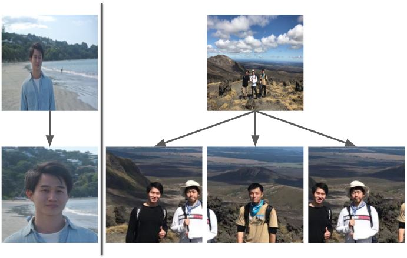

# Multi-task Cascaded Convolutional Networks (MTCNN)
Face alignment  

# Requirements
- Tensorflow r1.7
- Python 2.7 or Python 3.5
- numpy 1.16.2
- scipy 1.1.0
- cv2
- scikit-learn
### environment setting cmds
```
apt-get update
apt-get install -y libsm6 libxext6 libxrender-dev libglib2.0-0
pip install opencv-python
pip install numpy==1.16.2
pip install scipy==1.1.0
```
# Test
```
python align_dataset_mtcnn.py
```
Note : input images must be in folders which are in the `input_dir` folder again.
# References
- [1](https://github.com/davidsandberg/facenet)
- [2](https://github.com/davidsandberg/facenet/wiki/Classifier-training-of-inception-resnet-v1)
